<br><br>

# Dokumentation

<br><br><br><br>

## Draconis occisio

<br><br><br><br><br><br><br><br><br><br>

### Paul Fuchs

### 54584

### MI20w2-B

<br>

### Dozenten/Prüfer: Prof. Dr. Marc Ritter, Manuel Heinzig

<br><br><br>

<h2 style="float: right;"> 24.08.2022 </h2>


<div id="pagebreak" \>

# Gliederung

- [Spielkonzept](#spielkonzept)

- [Herausforderungen](#herausforderungen)
    - [Bewältigung](#bewältigung)

- [Software-Architektur](#software-architektur)

- [Implementierungsdetails](#implementierungsdetails)
    - [Schild](#schild)
    - [Damage Over Time](#damage-over-time-effekt)
    - [Healthpackage](#healthpackage)

- [2D-Art](#2d-art)

- [Menüstruktur](#menüstruktur)

- [Spielanleitung](#spielanleitung)
    - [Bewegung](#bewegung)
    - [Fähigkeiten](#fähigkeiten)
    - [Cam-Lock](#cam-lock)
    - [Menü](#menü)

- [Installationsanleitung](#installationsanleitung)

- [Ausblick/Fazit](#fazit)

- [Quellen](#quellen)


<div id="pagebreak" \>


# Spielkonzept

<div style="text-align: justify; font-family: Arial, font-size: 12px, line-height: 1.15px;"> 
Dein Ziel ist es, durch das Besiegen mehrerer Drachen, Punkte für einen Highscore zu sammeln. Dabei ist jedem Drachen ein fester Wert und ein zufälliger Bonuswert zugeordnet, dies wird im Abschnitt <a href="#herausforderungen">Herausforderungen</a> beschrieben. Deine drei besten Highscores werden lokal auf deinem PC gespeichert.
Du startest mit einem Zeitpuffer von 5 Minuten und pro Kampf hast du 3 Minuten und 30 Sekunden Zeit einen Drachen zu besiegen. Solltest du erfolgreich sein, wird die restliche Zeit zu deinem Zeitpuffer hinzuaddiert. Wenn du es nicht schaffst, den Drachen zu besiegen, werden dir 3 Minuten und 30 Sekunden von deinem Zeitpuffer abgezogen.
Du hast das Spiel verloren, wenn dein Zeitpuffer aufgebraucht ist oder deine Lebenspunkte auf 0 gesunken sind.
Für den Kampf stehen dir 2 Zauber zur Verfügung:
    ein Schild zur Verteidigung und der Feuertornado für den Angriff
</div>

# Herausforderungen

<div style="text-align: justify; font-family: Arial, font-size: 12px, line-height: 1.15px;">
Im "Play"-Menü kannst du zwischen vier unterschiedlichen Drachen oder einer zufälligen Reihenfolge auswählen.
Dabei hat jeder Drache unterschiedliche Mechaniken.
</div>

| Name 	| Souleater 	| Nightmare 	| Usurper 	| Terrorbringer 	|
|:---:	|:---:	|:---:	|:---:	|:---:	|
| Bild 	| 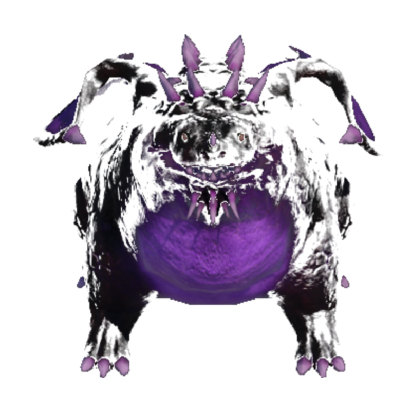 |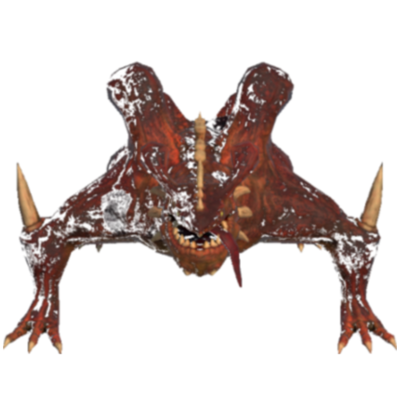|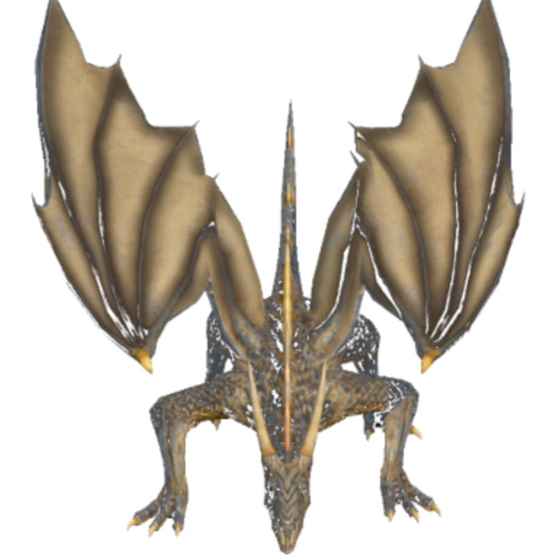|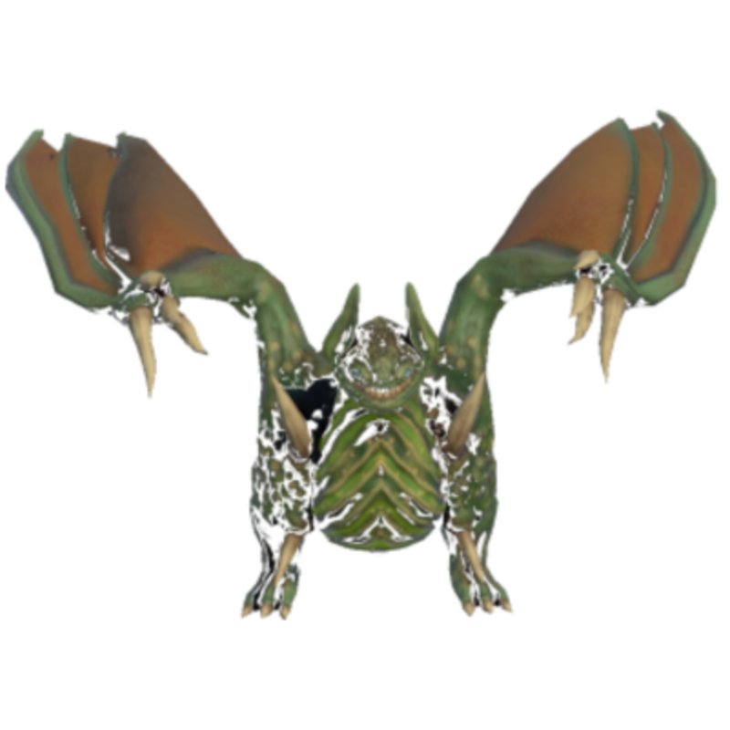|
| Eigenschaften 	| Bewegung am Boden<br><br>Schießt einen kleinen Feuerball mit geringem Schaden 	| Bewegung am Boden<br><br>Schießt einen Tornado mit mittlerem Schaden 	| Bewegung in der Luft<br><br>Schießt einen Tornado mit mittlerem Schaden 	| Bewegung in der Luft<br><br>Schießt drei Tornados mit jeweils mittlerem Schaden 	|
| Punkteberechnung 	| 90 + 100 * (0 - 0.3) 	| 120 + 100 * (0 - 0.45) 	| 240 + 100 * (0 - 0.75) 	| 160 + 100 * (0 - 0.45) 	|

Wenn dich ein Drache mit einer Fernkampf-Attacke trifft, werden dir Lebenspunkte abgezogen. Genauso verlierst du Lebenspunkte, wenn du einen Drachen berührst.

## Bewältigung 

<div style="text-align: justify; font-family: Arial, font-size: 12px, line-height: 1.15px;">
Verlorene Lebenspunkte kannst du durch Einsammeln von Heilungspaketen wiederherstellen. Auf der Tribüne sind fünf Heilungspakete verteilt, diese erscheinen, 45 Sekunden nachdem sie eingesammelt wurden, wieder. 
</div>

# Software Architektur

Zum UML-Diagramm: 
[Klassendiagramm](references/UML-Diagramm.pdf)

Zur Dokumentation: 
[Docs](references/Docs_DO.pdf)
<br>
<div style="text-align: justify; font-family: Arial, font-size: 12px, line-height: 1.15px;">
Ich habe mich dazu entschieden, die Klassen / Monobehaviour basierend auf der Verwendung im Spiel zu ordnen, so ist bspw.:

- der _PlayerTornado_ im _Player_ Ordner 
und 
- der _EnemyTornado_ im _Enemy_ Ordner

statt einer Differenzierung in der Funktionalität, wie es 

- der _PlayerTornado_ im _Projectile_ Ordner 
- der _EnemyTornado_ im _Projectile_ Ordner

wäre. 
</div>

# Implementierungsdetails

## Code

<div style="text-align: justify; font-family: Arial, font-size: 12px, line-height: 1.15px;">
Das Grundprinzip der Animationhandler für Spieler und Drachen habe ich aus dem folgenden Video übernommen:
<a href="https://www.youtube.com/watch?v=ZwLekxsSY3Y&ab_channel=Tarodev">Animate-like-a-programmer</a>.
</div>
<br>
<div style="text-align: justify; font-family: Arial, font-size: 12px, line-height: 1.15px;">
An dieser Stelle möchte ich noch einen kurzen Hinweis auf die <a href="../../rpg_wizard/Assets/Scripts/CustomUtils/ReferenceTable.cs">ReferenceTable</a> geben. Diese hält die statischen Referenzen auf den <a href="../../rpg_wizard/Assets/Scripts/CustomUtils/GameManager.cs">GameManager</a>, den Spieler und den momentan lebenden Drachen und ist somit verantwortlich für die Target-locked Camera. Das Behaviour ist aufgrund der Suche nach den Gameobjects mittels Tag, das wohl teuerste im gesamten Spiel.
</div>

## VFX

Folgende VFX sind nach Tutorials entstanden:

- Tornado
<br>

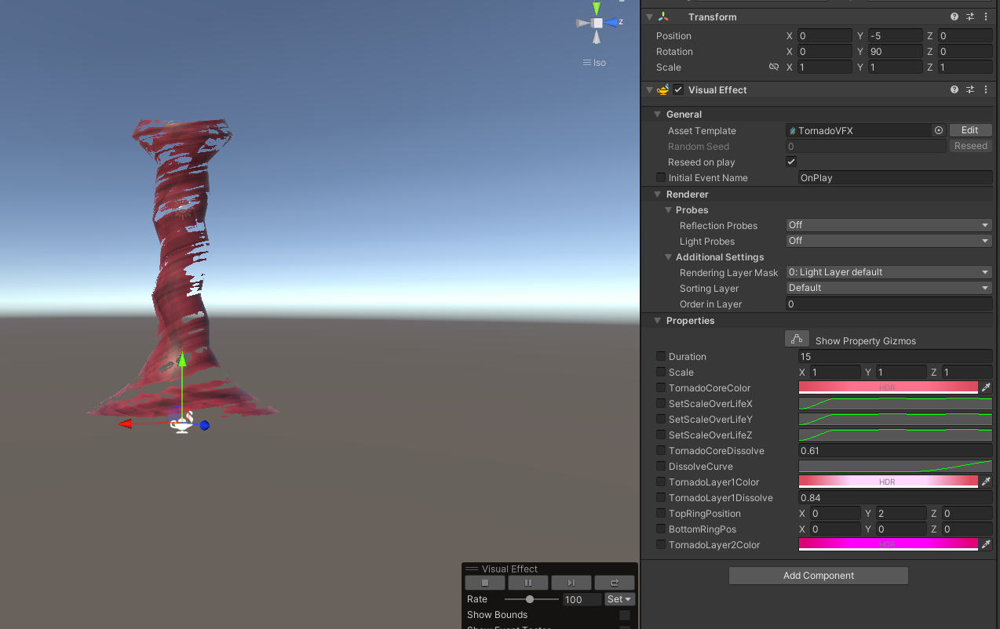
- Schild
<br>

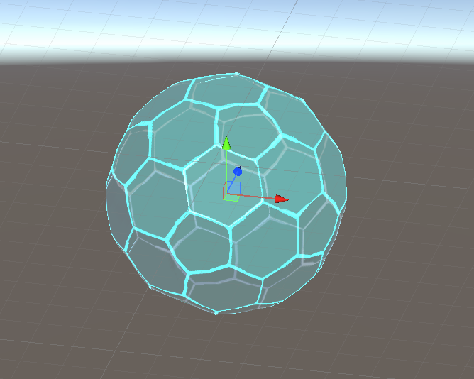
<br>


## Schild

<div style="text-align: justify; font-family: Arial, font-size: 12px, line-height: 1.15px;">
Damit das Schild seinen Zweck erfüllt, habe ich Layer verwendet. Das Monobehaviour des Drachentornado überprüft zunächst, ob das kollidierte Objekt auf dem Schild Layer liegt und wenn dies der Fall ist, zerstört sich der Drachentornado selbst.
</div>

```C#
public void OnTriggerEnter(Collider other) {
    if (other.gameObject.layer == LayerMask.NameToLayer("Shield")) 
        StartCoroutine(DestroyThis());
}

public IEnumerator DestroyThis(){
    Destroy(transform.parent.gameObject);
    yield return new WaitForSeconds(.3f);
}
```

## Damage over Time Effekt 

<div style="text-align: justify; font-family: Arial, font-size: 12px, line-height: 1.15px;">
Da Feuer brennt, hat der Tornado einen Damage over Time Effekt.
Der Algorithmus dazu liegt im Health beschrieben:
</div>

```C#
private IEnumerator GetDamaged(int value, float time, int tickRate) {
    var tickTime = time / tickRate;
    var actualTickRate = tickRate;

    while (tickRate > 0) {
        yield return new WaitForSeconds(tickTime);
        GetDamagedInstantly(value / actualTickRate);
        tickRate--;
    }
    GetDamagedInstantly(value % actualTickRate);
}
```
```
Beweis:
(x // 3) * 3 + x mod 3 = x
    --> // - Floor Division

- 50 // 3 = 16

- 16 * 3 = 48
- 50 mod 3 = 2
- 48 + 2 = 50 q.e.d. 
```

## Healthpackage

<div style="text-align: justify; font-family: Arial, font-size: 12px, line-height: 1.15px;">
Der Hologram Shader ist nach einem Tutorial entwickelt.
Nachdem ich die VFX für das Feuer und den Tornado anhand von Tutorials erstellt habe, wollte ich den VFX für das Healthpackage selbst erstellen, um mein Erlerntes anzuwenden.
</div>
Der Graph:
<br>

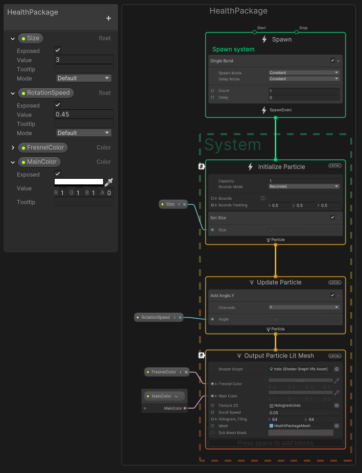
<br>
Output:
<br>

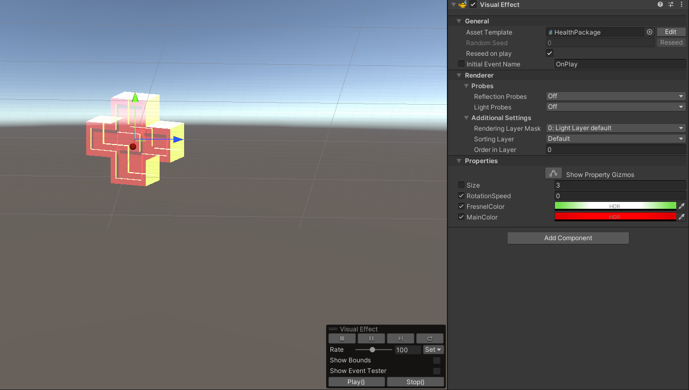
<br>
<div style="text-align: justify; font-family: Arial, font-size: 12px, line-height: 1.15px;">
Einstellbar sind die Größe des angezeigten Objekts, die Geschwindigkeit mit der sich das Paket um die eigenen vertikale Achse dreht, die Fresnel-Color, also die Farbe mit der Hologram-Linien dargestellt werden und die Main-Color.
</div>
<br>

Lighting:
<br>

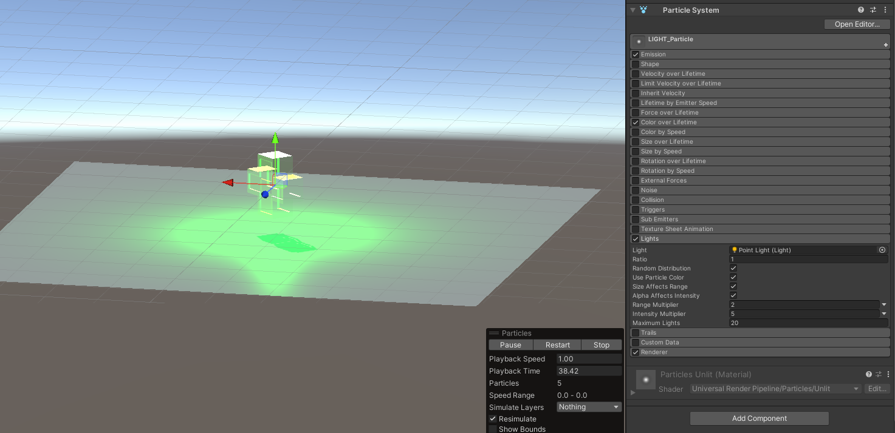
<br>

<div style="text-align: justify; font-family: Arial, font-size: 12px, line-height: 1.15px;">
Um dem Spieler intuitiv zu zeigen, dass es sich um ein Objekt handelt, das eingesammelt werden kann und ein kleines Highlighting zu geben, da die Heilungspakete von der Ausgangsposition des Spielers nicht zu sehen sind, habe ich das Partikel-System aus dem Feuer-Tutorial, welches das Lighting verursacht, auf die Farben des Heilungspakets abgestimmt und wiederverwendet.
</div>

## Sound
<div style="text-align: justify; font-family: Arial, font-size: 12px, line-height: 1.15px;">
Die Sound-Effekte beim Treffen eines Gegners, selbst getroffen werden und Einsammeln eines Healthpackages habe ich mit AudaCity erstellt.
</div>

# 2D Art

<div style="text-align: justify; font-family: Arial, font-size: 12px, line-height: 1.15px;">
Da ich den Großteil der 3D-Modelle aus dem Unity Assetstore verwendet habe, wollte ich die 2D Art selbst erstellen. 
So sind die Zeichnungen und Bilder entweder mit Sketchbook gezeichnet oder mittels Screenshot aufgenommen und später mit GIMP nachbearbeitet worden.
</div>

## Lebensanzeige

<div style="text-align: justify; font-family: Arial, font-size: 12px, line-height: 1.15px;">
Nach einigen Skizzen für eine Lebensanzeige und Feedback von Freunden, ist aus dem Balken 
<br>

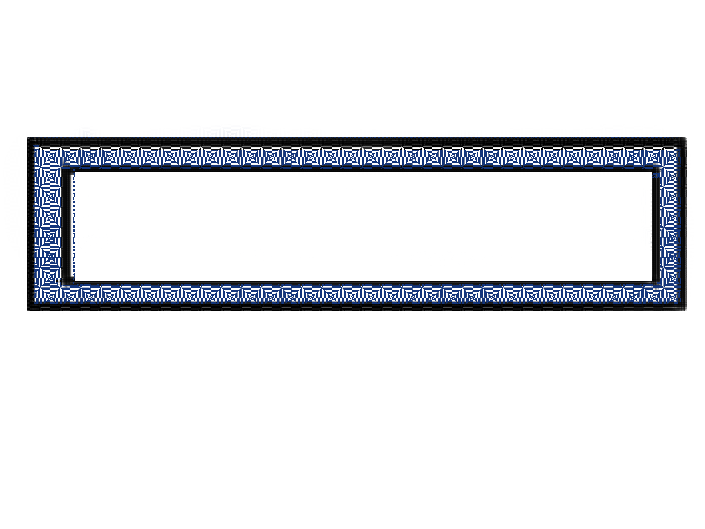

eine Herz-Anzeige geworden.
<br>

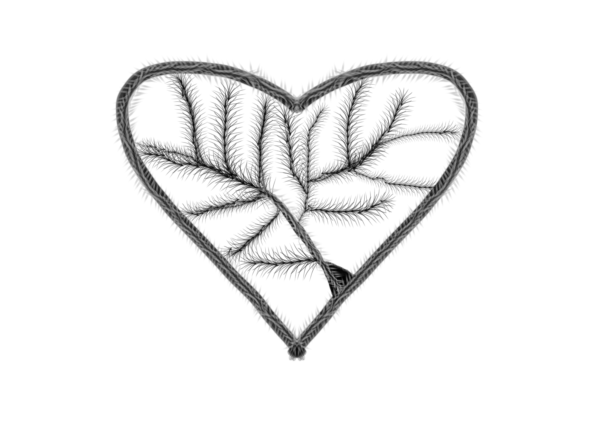
</div>

<div id="pagebreak" \>

## Flammentextur

<div style="text-align: justify; font-family: Arial, font-size: 12px, line-height: 1.15px;">
Um die Alpha Details des Torch-Shader auszunutzen, habe ich eine schwarz-weiß-graue Textur für die Flamme gezeichnet.
</div>

<br>

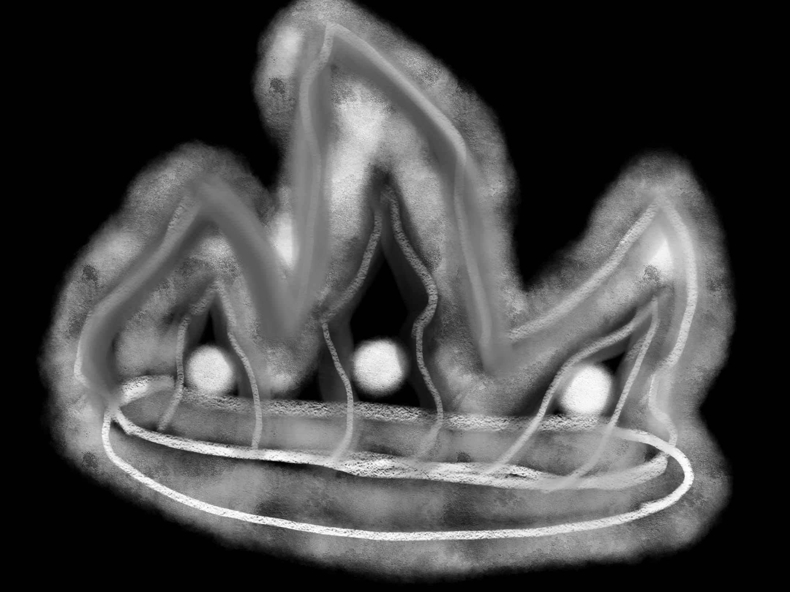

## Button

<div style="text-align: justify; font-family: Arial, font-size: 12px, line-height: 1.15px;">
Nachdem ich mir eine Menüstruktur und -layout überlegt hatte, habe ich die Sprites für die Buttons gezeichnet. Nach einfachen, symmetrischen Rechtecken
<br>

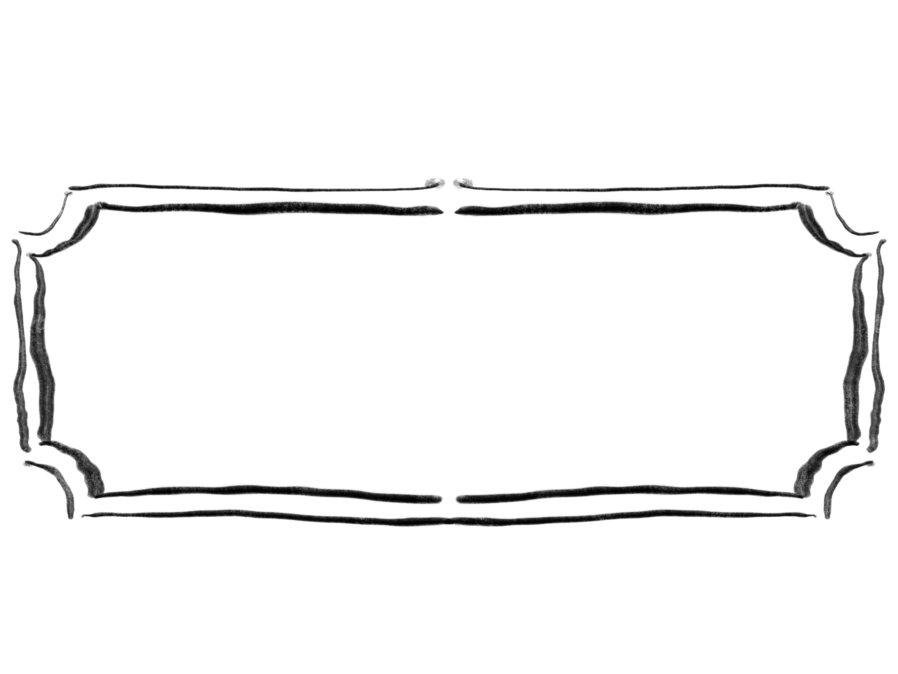

habe ich ein paar Verzierungen hinzugefügt, um dem mittelalterlichen Setting des Spiels gerecht zu werden.
<br>

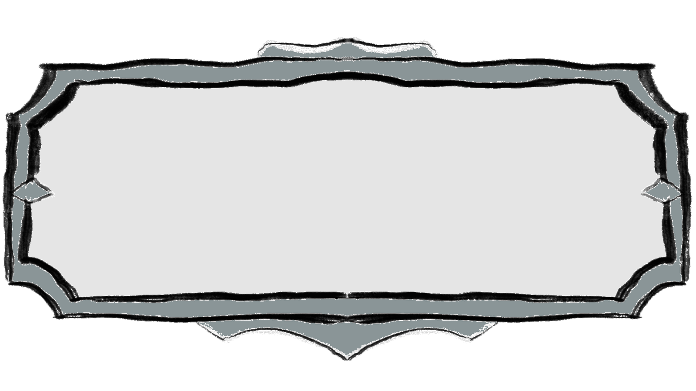

</div>

## Skybox

<div style="text-align: justify; font-family: Arial, font-size: 12px, line-height: 1.15px;">
Letztlich habe ich noch eine Textur für die Skybox gezeichnet.
<br>

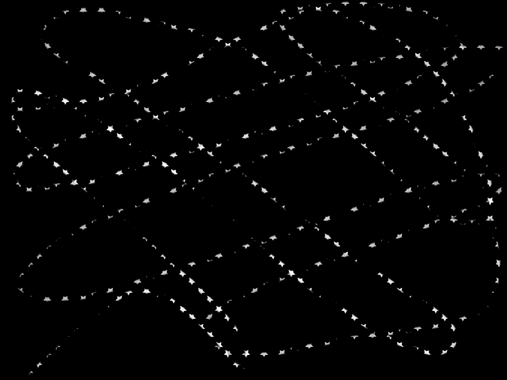
</div>

# Menüstruktur

<div style="text-align: justify; font-family: Arial, font-size: 12px, line-height: 1.15px;">
Ich habe mich dazu entschieden, die Buttons im Startbildschirm des Spiels auf der linken Seite des Bildschirms zu platzieren, da das Auswahl-Menü des <i>Play</i>-Buttons dazu gehört, ist die Platzierung hier einheitlich. Um den Platz auf der rechten Seite zu füllen, habe ich eine Collage aus Zauberer gegen Drache erstellt. <br>

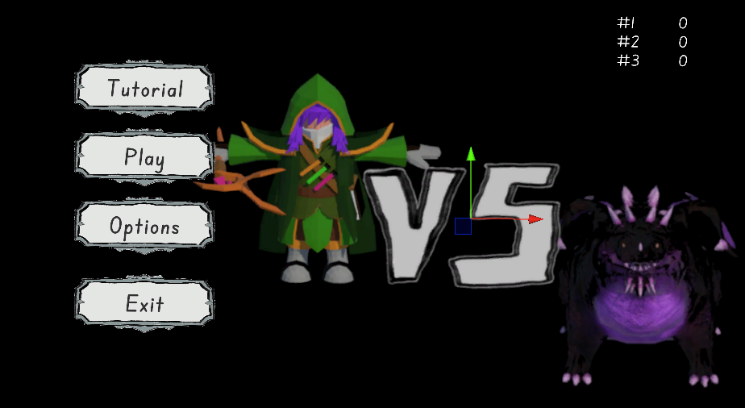

Im Pausemenü gibt es nur drei Auswahlmöglichkeiten: Weiterspielen, Optionen und zurück zum Hauptmenü. Da der Spieler den Blick während des Spiels in der Mitte des Bildschirms hat, sind auch die Buttons im Pausemenü in der Mitte angeordnet. <br>
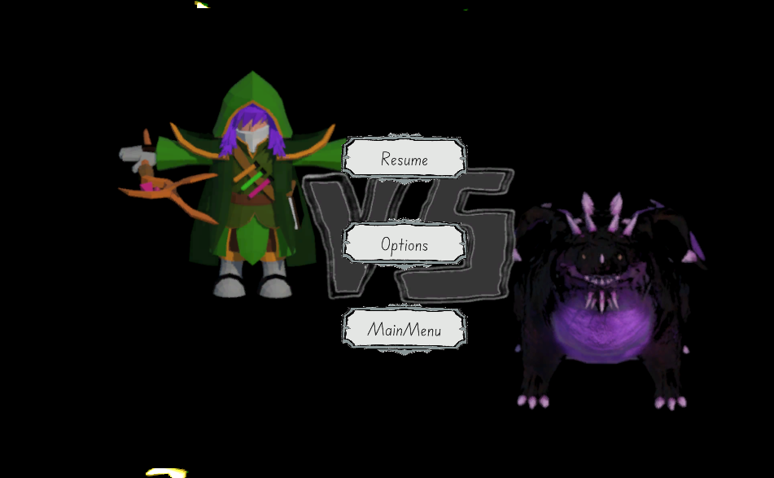
Im Optionsmenü gibt es nur eine geringe Anzahl von Einstellungen, weshalb die Slider in der Mitte sind. Somit sieht der Spieler direkt, was er einstellen kann. <br>

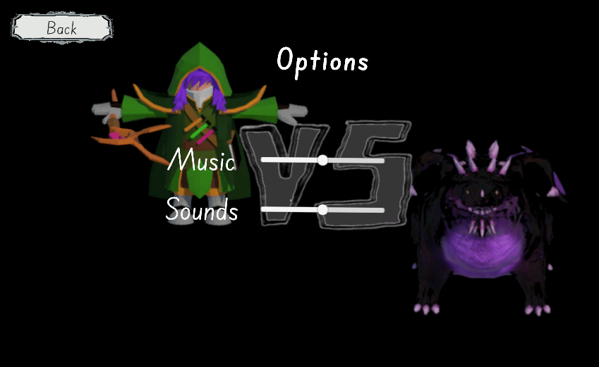
</div>

# Spielanleitung

<div style="text-align: justify; font-family: Arial, font-size: 12px, line-height: 1.15px;">
Du findest dich als Zauberer mit einer Third-Person Perspektive in einer Arena wieder und anhand deiner Auswahl kämpfst du gegen einen oder unterschiedlich wiederkehrende Drachen.
</div>

## Bewegung
<div style="text-align: justify; font-family: Arial, font-size: 12px, line-height: 1.15px;">
Mit den Tasten <b>WASD</b> kannst du dich in alle Kompass-Richtungen bewegen und mit der <b>Leertaste</b> kannst du springen.
<br>
(Kleiner Tipp: Stehe still und halte die Leertaste gedrückt)
</div>

## Fähigkeiten

<div style="text-align: justify; font-family: Arial, font-size: 12px, line-height: 1.15px;">
Im unteren mittleren Bereich des Bildschirms, siehst du links neben deiner Spielfigur ein Schild. Dieses kannst du durch Drücken der <b>Q</b> Taste aktivieren. Rechts daneben siehst du einen Tornado, diesen kannst du mit der <b>E</b> Taste auslösen und mittels <b>Mausbewegung</b> in Third-Person steuern.
Beide Fähigkeiten haben eine Abklingzeit, also nutze sie weise.
</div>

## Cam-Lock

<div style="text-align: justify; font-family: Arial, font-size: 12px, line-height: 1.15px;">
Durch Drücken der <b>F</b> Taste bleibt die Kamera auf den Drachen fokussiert und deine Ansicht wechselt in eine First-Person Perspektive.
</div>

## Menü

<div style="text-align: justify; font-family: Arial, font-size: 12px, line-height: 1.15px;">
Die <b>Esc</b> Taste pausiert das Spiel und du hast die Möglichkeit die Lautstärke der Hintergrundmusik und der Soundeffekte anzupassen. Solltest du aus dem Pausemenü zum Hauptmenü zurückkehren, gilt der Run als verloren, deine bisher gesammelten Highscore-Punkte, werden aber gespeichert.
</div>

# Installationsanleitung

1. ZIP-Ordner _Draconis Occisio_ entpacken
2. **Draconis occisio** Anwendung ausführen
<div id="pagebreak" \>

# Fazit

<div style="text-align: justify; font-family: Arial, font-size: 12px, line-height: 1.15px;">
Dies ist das erstes Spiel, welches ich alleine erstellt habe. Natürlich gibt es einige Verbesserungsmöglichkeiten. Das Userinterface kann beispielsweise durch ansprechendes Feedback für den Spieler intuitiver gestaltet werden und im Play-Menü sollte die Coroutine, die beim Hovern auf dem Random - Button läuft, gestoppt werden, sobald das Hovern endet. Eine weitere Verbesserung kann im Aufbau der Software-Architektur gemacht werden, sodass ein modularer Aufbau erreicht wird. Vor allem hinsichtlich abstrakter Klassen und einer Klassenstruktur und -ordnung nach Funktionalität. Eine erste Idee hierfür ist, eine abstrakte Projektil-Klasse zu erstellen, mit der die Bewegung und der Schaden der Tornados eingestellt werden kann und in der Ausimplementierung in Enemy und Player wird dann die "OnTriggerEnter" bzw. "OnCollisionEnter" - Methode überschrieben. <br>
Die nächste Verbesserung sehe ich in den Drachen-Prefabs. Auf jedem Drachen liegen doppelte Collider, zur Kollisionsdetektion mit dem Spieler und zur Triggerdetektion eines Tornados. Ein Collider sollte für die Implementierung der Schadensevaluierung ausreichen. (Ja, doppelte Hits mit dem Spielertornado sind möglich, aber selten). <br>
Die Umsetzung für dieses Spiel ist aus einer stark eingekürzten Version meiner <a href="references/GDD_InveniLibera.pdf">Game-Design Idee</a> aus dem letzten Semester entstanden. Ich habe die Idee insofern abgeändert, dass das Ziel des Spiels das Erreichen eines Highscores ist und der Spieler mit zwei Fähigkeiten startet. Doch Setting und Grundgefühl sollten dasselbe bleiben. <br>
Abschließend ist zu sagen, dass ich mit dem Ergebnis zufrieden bin.
</div>

<div id="pagebreak" \>

# Quellen

- 3D-Assets:
    - [Zauberer](https://assetstore.unity.com/packages/3d/characters/humanoids/fantasy/battle-wizard-poly-art-128097)
    - [Arena](https://assetstore.unity.com/packages/3d/environments/fantasy/low-poly-gladiators-arena-167116)
    - [Drachen](https://assetstore.unity.com/packages/3d/characters/creatures/dragon-for-boss-monster-pbr-78923)

- VFX:
    - [Tornado](https://www.youtube.com/watch?v=gLWe_Wzc8Xc&ab_channel=GabrielAguiarProd.)
    - [Schild](https://www.youtube.com/watch?v=IZAzckJaSO8&ab_channel=GabrielAguiarProd.)
    - [Feuer](https://www.youtube.com/watch?v=XQlFokCzU6M&ab_channel=GabrielAguiarProd.)

- Shader:
    - [Hologram](https://www.youtube.com/watch?v=wtZ5WcrV-9A&ab_channel=DanielIlett)

- Tools:
    - [Jetbrains-Rider](https://www.jetbrains.com/de-de/rider/)
    - [DocFX](https://dotnet.github.io/docfx/tutorial/docfx_getting_started.html) zur Erstellung einer Dokumentation anhand der Kommentare
    - [Unity](https://unity3d.com/de/unity/qa)
        - CineMachine
        - Visual Effects Graph
        - [JsonConvert](https://assetstore.unity.com/packages/tools/input-management/json-net-for-unity-11347)
    - LucidChart

- [FieldOfView-Drachen](https://www.youtube.com/watch?v=j1-OyLo77ss&ab_channel=Comp-3Interactive)

<div id="pagebreak" \>

# Anhang

### Menü Entwurf
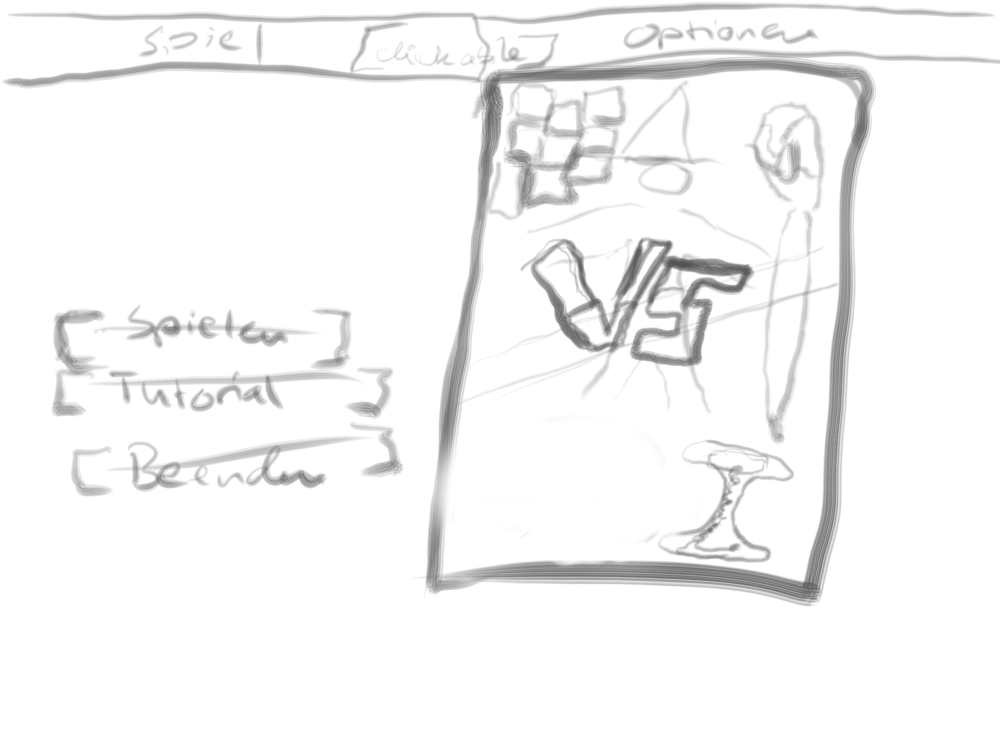

<div id="pagebreak" \>

# Selbstständigkeitserklärung

<div style="text-align: justify; font-family: Arial, font-size: 12px, line-height: 1.15px;">
Hiermit erkläre ich, dass ich die vorliegende Arbeit mit dem Titel
</div>

## Draconis occisio

<div style="text-align: justify; font-family: Arial, font-size: 12px, line-height: 1.15px;">
selbstständig und ohne unerlaubte fremde Hilfe angefertigt, keine anderen als die angegebenen Quellen verwendet und die verwendeten Quellen als solche kenntlich gemacht habe.
</div>

<br><br><br>

Rochlitz, den 24.08.2022

<br>

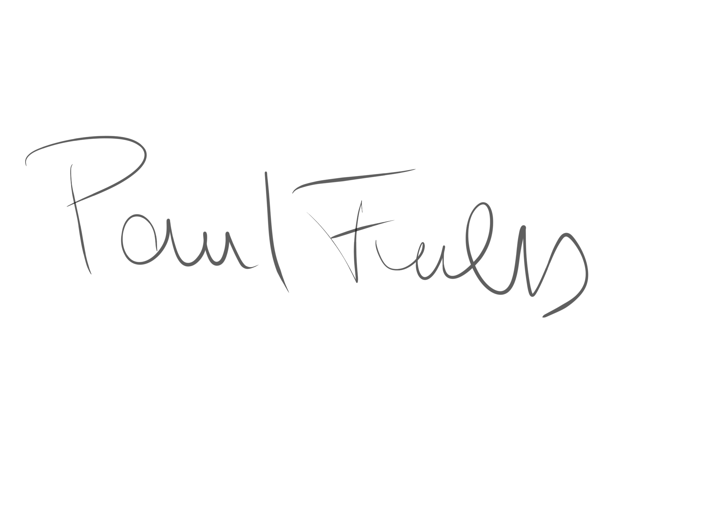

